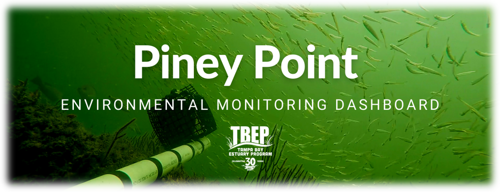
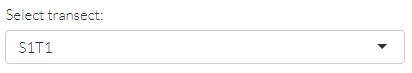

  
```{r setup, include=F}
knitr::opts_chunk$set(echo = F, message = F, warning = F)

# libraries
library(flexdashboard)
library(mapview)
library(leaflet)
library(tidyverse)
library(sf)
library(plotly)
library(leafem)
library(colorspace)
library(scales)
library(reactable)
library(tbeptools)
library(patchwork)
library(shinyWidgets)

source('R/funcs.R')

load('data/bswqdat.RData')
load('data/bswqdatsub.RData')
load('data/bsstatloc.RData')
load('data/rswqdat.RData')
load('data/rsstatloc.RData')
load('data/parms.RData')
load('data/bstransect.RData')
load('data/bstransectocc.RData')
load('data/trnpts.RData')
load('data/trnlns.RData')
load('data/rstrnpts.RData')
load('data/rstrnlns.RData')
load('data/rstrndatmcr.RData')
load('data/rstrndatsav.RData')
load('data/macrodat.RData')
load('data/rsbntpts.RData')
load('data/bswqrngs.RData')

# log
log <- readLines('https://tbep-tech.github.io/piney-point/logs/indexlog.txt')

##
# globals

# map types
mptyps <- c("CartoDB.Positron", "CartoDB.DarkMatter", "OpenStreetMap", "Esri.WorldImagery", "OpenTopoMap")

# proj
prj <- 4326

# font
fml <- 'Lato Light'

# line colors on baseline
cols <- qualitative_hcl(length(unique(bswqdat$var)), palette = "Dynamic")

# station colors on maps
stacols <- qualitative_hcl(length(unique(rsstatloc$source_lng)), palette = "Dark2")
names(stacols) <- sort(unique(rsstatloc$source_lng))

# variable color on maps
vrscols <- rev(sequential_hcl(11, palette = 'Blues'))

# value box colors
boxcol <- '#00806E'

# piney point loc
pineypoint <- c(-82.52469352586753, 27.629819505234703)

# map center
mapcenter <- c(-82.57862105363802, 27.624588580411267)

# seagrass transect prj
st_crs(trnpts) <- 4326

# non-bay stations
nonbay <- c('BH01', 'P Port 2', 'P Port 3', 'PM Out', '20120409-01', 'PPC41', 'P Port 4', 'PMB01')

# seagrass species
spp <- c("Halodule", "Syringodium", "Thalassia", "Halophila", "Ruppia", "Caulerpa")

# seagrass transects near pp
trns <- sort(unique(bstransect$Transect))

# macroalgae transect near pp
rstrns <- sort(unique(rstrndatsav$station))

# benthic sites
rsbnts <- sort(unique(rsbntpts$station))

# sources lookup
srcs <- rsstatloc %>% 
  st_set_geometry(NULL) %>% 
  select(source_lng, source) %>% 
  unique

# variables to select from available
vrs <- parms %>% 
  select(lbs, var) %>% 
  filter(var %in% rswqdat$var) %>% 
  deframe %>% 
  as.list
```

```{r statics}
# response sampling locations
rslocs <- rsstatloc %>% 
  mutate(
    lon = st_coordinates(.)[, 1],
    lat = st_coordinates(.)[, 2]
  ) %>% 
  st_set_geometry(NULL) %>% 
  select(
    `Data source` = source_lng, 
    `Station` = station, 
    Longitude = lon, 
    Latitude = lat
  )

# baseline wq map
tomap <- as.list(stacols) %>% 
  enframe('source', 'col') %>% 
  unnest(col) %>% 
  left_join(bsstatloc, ., by = 'source')
tomapcols <- tomap %>% 
  st_set_geometry(NULL) %>% 
  select(source, col) %>% 
  unique
bswqmap <- mapview(tomap, homebutton = F, layer.name = 'Data source', map.types = mptyps, legend = F) %>%
  .@map %>% 
  clearMarkers() %>% 
  addCircleMarkers(
    data = tomap,
    layerId = ~station,
    stroke = TRUE,
    color = 'black',
    fill = TRUE,
    fillColor = tomap$col,
    weight = 1,
    fillOpacity = 1,
    radius= 6
  ) %>% 
  addStaticLabels(
    data = tomap,
    label = tomap$station,
    direction = 'top',
    textsize = "20px", 
    offset = c(0, 1)
  ) %>% 
  addMarkers(lng = pineypoint[1], lat = pineypoint[2], label = 'Piney Point') %>% 
  addLegend("topright", title = 'Data source', opacity = 1, labels = tomapcols$source, colors = tomapcols$col) 

# current base mape
rscolsin <- rswqdat %>% 
  left_join(rsstatloc, by = 'source') %>% 
  pull(source_lng) %>% 
  unique %>% 
  stacols[.] 
rswqmap <- rsstatloc %>% 
  filter(station %in% rswqdat$station) %>% 
  mapview(zcol = 'source_lng', homebutton = F, layer.name = 'Data source', col.regions = rscolsin, map.types = mptyps) %>% 
  .@map %>% 
  addMarkers(lng = pineypoint[1], lat = pineypoint[2], label = 'Piney Point')
rswqmapall <- rsstatloc %>% 
  mapview(zcol = 'source_lng', homebutton = F, layer.name = 'Data source', col.regions = stacols, map.types = mptyps) %>% 
  .@map %>% 
  addMarkers(lng = pineypoint[1], lat = pineypoint[2], label = 'Piney Point')

# summary of agencies reporting for value boxes
agns <- rswqdat %>% 
  pull(source) %>% 
  unique %>% 
  length

# summary of variables measured for value boxes
vars <- rswqdat %>% 
  pull(var) %>% 
  unique %>% 
  length

# summary of days of sampling for value boxes
dysm <- rswqdat %>% 
  pull(date) %>% 
  unique %>% 
  length

# summary of sites being monitored for value boxes
stsm <- rswqdat %>% 
  pull(station) %>% 
  unique %>% 
  length

# summary of samples for value boxes
smsm <- rswqdat %>% 
  nrow

# seagrass base map
sgmap <- mapview(trnpts, homebutton = F, legend = F) %>% 
  .@map %>% 
  clearMarkers()
for(i in unique(trnlns$station))
  sgmap <- sgmap %>% 
    addPolylines(
      data = trnlns[trnlns$station %in% i, ], 
      lng = ~lng, 
      lat = ~lat, 
      color = 'grey', 
      label = ~station
    )
sgmap <- sgmap %>% 
  addCircleMarkers(
    data = trnpts,
    layerId = ~station,
    stroke = TRUE,
    color = 'black',
    fill = TRUE,
    fillColor = 'grey',
    weight = 1,
    fillOpacity = 1,
    radius= 4,
    label = ~paste0('Transect ', station)
  ) %>% 
  addStaticLabels(
    data = trnpts,
    label = trnpts$station, 
    direction = 'top', 
    textsize = '15px',
    offset = c(0, 1)
  ) %>% 
  addMarkers(lng = pineypoint[1], lat = pineypoint[2], label = 'Piney Point')

# rapid response transect base map
rstrnmap <- mapview(rstrnpts, homebutton = F, legend = F) %>% 
  .@map %>% 
  clearMarkers()
for(i in unique(rstrnlns$station))
  rstrnmap <- rstrnmap %>% 
    addPolylines(
      data = rstrnlns[rstrnlns$station %in% i, ], 
      lng = ~lng, 
      lat = ~lat, 
      color = 'grey', 
      label = ~paste0('Transect ', station, ' (', toupper(source), ')')
    )
rstrnmap <- rstrnmap %>% 
  addCircleMarkers(
    data = rstrnpts,
    layerId = ~station,
    stroke = TRUE,
    color = 'black',
    fill = TRUE,
    fillColor = 'grey',
    weight = 1,
    fillOpacity = 1,
    radius= 4,
    label = ~paste0('Transect ', station, ' (', toupper(source), ')')
  ) %>% 
  addStaticLabels(
    data = rstrnpts,
    label = rstrnpts$station, 
    direction = 'top', 
    textsize = '15px',
    offset = c(0, 1)
  ) %>% 
  addMarkers(lng = pineypoint[1], lat = pineypoint[2], label = 'Piney Point')

# response benthic sampling base map
rsbntmap <- mapview(rsbntpts, homebutton = F, legend = F) %>% 
  .@map %>% 
  clearMarkers() %>% 
  addCircleMarkers(
    data = rsbntpts,
    layerId = ~station,
    stroke = TRUE,
    color = 'black',
    fill = TRUE,
    fillColor = 'grey',
    weight = 1,
    fillOpacity = 1,
    radius= 4,
    label = ~paste0('Station ', station)
  ) %>% 
  addStaticLabels(
    data = rsbntpts,
    label = rsbntpts$station, 
    direction = 'top', 
    textsize = '15px',
    offset = c(0, 1)
  ) %>% 
  addMarkers(lng = pineypoint[1], lat = pineypoint[2], label = 'Piney Point')

# response phytoplankton sampling base map
rsphymap <- mapview(rsbntpts, homebutton = F, legend = F) %>% 
  .@map %>% 
  clearMarkers() %>%
  addMarkers(lng = pineypoint[1], lat = pineypoint[2], label = 'Piney Point')
```

```{r reactives}
# water quality map, baseline data
bswqmap1 <- reactive({
  
  # inputs
  stasel1 <- input$stasel1

  toadd <- bsstatloc %>% 
    filter(station %in% stasel1)

  mout <- bswqmap %>% 
    addCircleMarkers(
      data = toadd,
      layerId = ~station,
      stroke = TRUE,
      color = 'black',
      fill = TRUE,
      fillColor = 'red',
      weight = 1,
      fillOpacity = 1,
      radius= 6
    ) %>% 
    setView(mapcenter[1], mapcenter[2], zoom = 12)
  
  return(mout)
})

# complete time series, baseline data
baseplo1 <- reactive({
  
  # inputs
  stasel1 <- input$stasel1
  
  out <- plo_fun(bswqdat, stasel1, cols, parms)
  
  return(out)
  
})

# march/april time series, baseline data
baseplo2 <- reactive({
  
  # inputs
  stasel1 <- input$stasel1
  
  out <- plo_fun(bswqdatsub, stasel1, cols, parms)
  
  return(out)
  
})

# baseline variable text ranges
bswqtxt <- reactive({
  
  # input
  varsel1 <- input$varsel1

  tmp <- bswqrngs %>% 
    filter(var == !!varsel1) 
  
  out <- HTML(paste('Normal range for March/April (mean +/- 1 sd):<b>', tmp$minv, '-', tmp$maxv, tmp$lbs, '</b><br></br>'))
  
  return(out)
  
})

# variable range
varrng1 <- reactive({
  
  # input
  varsel1 <- input$varsel1
  rmvssta <- input$rmvssta
  
  out <- rswqdat %>% 
    filter(var %in% varsel1) 
  
  if(rmvssta)
    out <- out %>% 
      filter(!station %in% nonbay)
  
  out <- out %>% 
    pull(val) %>% 
    range(na.rm = T)
  
  return(out)
  
})

# color palette function
colfun <- reactive({
  
  # input
  varsel1 <- input$varsel1
  varrng1 <- varrng1()
  
  # color palette function
  out <- colorNumeric(
    palette = vrscols,
    na.color = 'yellow',
    domain = varrng1
    )
  
  return(out)
  
})

# response data
rsdat1 <- reactive({
  
  # input
  varsel1 <- input$varsel1
  dyssel1 <- input$dyssel1
  mapsel1 <- input$mapsel1
  rmvssta <- input$rmvssta
  colfun <- colfun()
  
  req(colfun)
  
  out <- rswqdat %>% 
    filter(var %in% varsel1) 
  
  if(rmvssta)
    out <- out %>% 
      filter(!station %in% nonbay)
    
  out <- out %>% 
    mutate(
      cols = colfun(val),
      cexs = scales::rescale(val, to = c(4, 17))
    ) 
 
   # filter by day if provided
  if(mapsel1){
    
    out <- out %>% 
      filter(date %in% dyssel1)
    
  }
  
  return(out)
  
})

# response data table
rstab1 <- reactive({
  
  # input
  rsdat1 <- rsdat1()
  varsel1 <- input$varsel1
  
  # variable label
  vrlb <- names(vrs)[vrs == varsel1]
  
  totab <- rsdat1 %>% 
    left_join(parms, by = 'var') %>% 
    left_join(srcs, by = 'source') %>% 
    select(
      Source = source_lng,
      Station = station ,
      Date = date, 
      val
    ) %>% 
    arrange(desc(Date))
  names(totab)[names(totab) == 'val'] <- vrlb
  
  out <- reactable(totab,
    defaultColDef = colDef(
      footerStyle = list(fontWeight = "bold"),
      format = colFormat(separators = F),
      resizable = TRUE
    ),
    filterable = T,
    defaultPageSize = nrow(totab)
    )
  
  return(out)
  
})

# response data map
rsmap1 <- reactive({
  
  # input
  rsdat1 <- rsdat1()
  colfun <- colfun()
  varrng1 <- varrng1()
  varsel1 <- input$varsel1
  
  req(rsdat1)

  # variable label
  vrlb <- names(vrs)[vrs == varsel1]

  # make sf
  tomap <- rsdat1 %>% 
    inner_join(rsstatloc, ., by = c('source', 'station'))
    
  # hover pt labels
  labs <- paste0('Station: ', tomap$station, ', Date: ', tomap$date, ', ', vrlb, ': ', round(tomap$val, 2))
  leglab <- vrlb

  if(nrow(tomap) == 0)
    m <- mapview()
   
  if(nrow(tomap) != 0)
    m <- mapview(tomap, cex = tomap$cexs, label = labs, legend = F, layer.name = F, col.regions = tomap$cols, homebutton = F, map.types = mptyps)
  
  # add legend
  out <- m@map %>% 
    addLegend("bottomright", pal = colfun, title = leglab, opacity = 1, values = varrng1) %>% 
    setView(mapcenter[1], mapcenter[2], zoom = 11) %>% 
    addMarkers(lng = pineypoint[1], lat = pineypoint[2], label = 'Piney Point')
  
  return(out)
  
})

# seagrass map selection
bssgmap1 <- reactive({
  
  # input
  trnsel1 <- input$trnsel1
  
  toadd <- trnpts %>% 
    filter(station %in% trnsel1)
  mout <- sgmap %>% 
    addCircleMarkers(
      data = toadd,
      layerId = ~station,
      stroke = TRUE,
      color = 'black',
      fill = TRUE,
      fillColor = 'red',
      weight = 1,
      fillOpacity = 1,
      radius= 6,
      label = ~paste0('Transect ', station)
    ) %>% 
    setView(mapcenter[1], mapcenter[2], zoom = 12)
  
  return(mout)
  
})

# seagrass transect plot over time
bssgtrnplo1 <- reactive({
  
  # input
  trnsel1 <- input$trnsel1
  
  p <- show_transect(bstransect, site = trnsel1, species = spp, varplo = 'Abundance', plotly = T, base_size = 11, yrrng = c(1998, 2021)) %>% 
    layout(
      title = list(text = NA), 
      legend = list(title = list(text = 'Abundance (BB)'))
    )
  
  
  return(p)
  
})

# seagrass summary plot over time
bssgsumplo1 <- reactive({
  
  # input
  trnsel1 <- input$trnsel1
  
  p <- show_transectsum(bstransectocc, site = trnsel1, species = spp, yrrng = c(1998, 2021)) %>% 
    layout(
      title = list(text = NA),
      legend = list(title = list(text = NA)),
      xaxis = list(title = list(text = 'Year'))
    )
  
  return(p)
  
})

# rapid response transect map selection
rstrnmap1 <- reactive({
  
  # input
  trnsel2 <- input$trnsel2
  
  toadd <- rstrnpts %>% 
    filter(station %in% trnsel2)
  mout <- rstrnmap %>% 
    addCircleMarkers(
      data = toadd,
      layerId = ~station,
      stroke = TRUE,
      color = 'black',
      fill = TRUE,
      fillColor = 'red',
      weight = 1,
      fillOpacity = 1,
      radius= 6,
      label = ~paste0('Transect ', station, ' (', toupper(source), ')')
    ) %>% 
    setView(mapcenter[1], mapcenter[2], zoom = 12)
  
  return(mout)
  
})

# rapid response sav selection
rstrnsavsel <- reactive({
  
  # input
  trnsel2 <- input$trnsel2
  
  out <- rstrndatsav %>% 
    filter(station %in% !!trnsel2) %>% 
    filter(sav_bb > 0) %>% 
    pull(sav_species) %>% 
    unique %>% 
    as.character
  
  return(out)
  
})

# rapid response mcr selection
rstrnmcrsel <- reactive({
  
  # input
  trnsel2 <- input$trnsel2
  
  out <- rstrndatmcr %>% 
    filter(station %in% !!trnsel2) %>% 
    filter(macroalgae_bb > 0) %>% 
    pull(macroalgae_species) %>% 
    unique %>% 
    as.character
  
  return(out)
  
})

# rapid response transect plot
rstrnplo1 <- reactive({
  
  # input
  trnsel2 <- input$trnsel2
  savsel <- input$savsel
  mcrsel <- input$mcrsel
  
  # req(mcrsel)
  # req(savsel)
  
  p <- show_rstransect(rstrndatsav, rstrndatmcr, station = trnsel2, savsel = savsel, mcrsel = mcrsel, base_size = 18) 
 
  return(p)
  
})

# rapid response benthic map selection
rsbntmap1 <- reactive({
  
  # input
  stasel2 <- input$stasel2
  
  toadd <- rsbntpts %>% 
    filter(station %in% stasel2)
  mout <- rsbntmap %>% 
    addCircleMarkers(
      data = toadd,
      layerId = ~station,
      stroke = TRUE,
      color = 'black',
      fill = TRUE,
      fillColor = 'red',
      weight = 1,
      fillOpacity = 1,
      radius= 6,
      label = ~paste0('Station ', station)
    ) %>% 
    setView(mapcenter[1], mapcenter[2], zoom = 12)
  
  return(mout)
  
})
```

OVERVIEW
=======================================================================

Column {data-width=650}
-----------------------------------------------------------------------

### __DASHBOARD INFORMATION__

<div class = "row">
<div class = "col-md-2"></div>
<div class = "col-md-8">

####

```{r out.width='80%', fig.align='center'}

```

[__JUMP TO LATEST DATA__](https://shiny.tbep.org/piney-point/#section-water-quality-results), last update `r log`

The Tampa Bay Estuary Program is working with regional partners to coordinate and synthesize water quality, benthic, seagrass, and fisheries monitoring data. We are also consulting with USF to model forecasted plume trajectory from the Piney Point discharge. 

The primary pollutants of concern for this discharge are phosphorus and nitrogen (primarily ammonia nitrogen), which may stimulate an algae response and cause adverse effects on seagrass, fish, and other wildlife.

The dashboard is a synthesis of data that can be used to assess baseline conditions prior to discharge and to evaluate changing water quality conditions as new data become available. __All data are provisional and subject to revision.__ The dashboard is arranged as follows:

1) __CURRENT DATA__: Locations being sampled by our partners in response to changing conditions, with an [overview summary](https://shiny.tbep.org/piney-point/#section-water-quality-overview) of sampling events to date and [current results](https://shiny.tbep.org/piney-point/#section-water-quality-results). Current  [seagrass/macroalgae](https://shiny.tbep.org/piney-point/#section-rapid-response-seagrassmacroalgae-surveys) data are also presented. Sediment (biology and chemistry) and algal samples have also been collected and the data are being processed.
1) __BASELINE DATA__: Long-term [water quality](https://shiny.tbep.org/piney-point/#section-water-quality) and [seagrass data](https://shiny.tbep.org/piney-point/#section-seagrasses) over a 25 year period.  

#### Additional resources

* Florida DEP Piney Point regional notification: <https://protectingfloridatogether.gov/PineyPointUpdate>
* USF Piney Point circulation modeling: <http://ocgweb.marine.usf.edu/~liu/Tracer/>
* NOAA algal bloom satellite imagery: <https://coastalscience.noaa.gov/research/stressor-impacts-mitigation/hab-monitoring-system/red-tide-from-satellite-for-southwest-florida/tampa-bay/>

#### Website information

The page source content can be viewed on [Github](https://github.com/tbep-tech/piney-point).

Questions and comments about the dashboard can be sent to [Marcus Beck](mailto:mbeck@tbep.org).

<a rel='license' href='http://creativecommons.org/licenses/by/4.0/'></a>&nbsp;&nbsp;This dashboard is licensed under a <a rel='license' href='http://creativecommons.org/licenses/by/4.0/'>Creative Commons Attribution 4.0 International License</a>.

[](https://zenodo.org/badge/latestdoi/353409644)

</div>
<div class = "col-md-2"></div>
</div>

WATER QUALITY RESULTS {data-navmenu="CURRENT DATA"}
=======================================================================

Column {data-width=400}
-----------------------------------------------------------------------

### __STATION LOCATIONS - PINEY POINT AT MARKER__

```{r}
output$rsmap1 <- renderLeaflet(rsmap1())
leafletOutput('rsmap1')
```

Column {.tabset .tabset-fade}
-----------------------------------------------------------------------

<br>
```{r}
column(12,
  column(3, HTML('<b>ALL DATA ARE PROVISIONAL</b><br></br>')),
  column(9,
    materialSwitch(inputId = 'rmvssta', label = 'Remove stations on land near Piney Point (these can skew in-bay results)?', width = '100%')
  )
)
column(12,
  column(3, 
    selectInput('varsel1', HTML('<b>Select variable:</b>'), choices = vrs, selected = 'nh3')       
  ), 
  column(3, 
    materialSwitch(inputId = 'mapsel1', label = 'Map results by date?', width = '100%')
    ),
  column(6, 
    renderUI({
      
      # inputs
      varsel1 <- input$varsel1
      mapsel1 <- input$mapsel1
 
      if(!mapsel1)
        return(NULL)
      
      dys <- rswqdat %>% 
        filter(var %in% varsel1) %>% 
        pull(date) %>% 
        unique
      
      sliderInput('dyssel1', 'Select date:', min = min(dys), max = max(dys), value = max(dys), animate = T, timeFormat="%m-%d", width = '100%')
  
    })     
  )
)
column(12, 
  column(12, 
    renderUI(bswqtxt())
  )
)
```

### __TABLE DATA__

```{r}
output$rstab1 <- renderReactable(rstab1())
reactableOutput('rstab1')
```

### __INFORMATION__

Use the variable selection menu on the top to view results for a measured water quality parameter of interest.  The map on the left will show results at locations that have been sampled for the parameter.  You can choose to show all dates or filter by a particular date. All points on the map are sized and colored by the range of values in the data for the selected parameter.  If results are filtered by date, hit the "play" button below the date slider to view a time lapse of data. The data table shows all results for the selection.

How are the data interpreted? 

As of `r log`, data from `r vars` parameters and `r agns` agencies have been added to this dashboard.  These parameters were chosen primarily to track the flow of nutrients from wastewater being discharged into the bay.  The primary environmental threat is an algae response as a result of high concentrations of nutrients in this wastewater. Excess algal can have adverse effects on seagrass, fish, and other wildlife.  __Nitrogen, either total nitrogen (TN) or ammonia (NH3), is the primary concern for tracking potential impacts of discharge from Piney Point.__

The parameters being monitored include: 

__Chlorophyll-a (ug/L)__: Chlorophyll is present in algal tissue and concentrations in the water column provide a measure of algae production. 

__Color (PCU)__: Water color in platinum cobalt units, changes in color can suggest a wastewater or stormwater source with different characteristics from ambient conditions. Higher PCU means darker waters.

__DO (mg/L)__: A measure of dissolved oxygen in the water column as a concentration (mg/L). Low dissolved oxygen less than 3 mg/L may indicate hypoxic conditions potentially harmful to biological organisms.

__DO (% saturation)__: A measure of dissolved oxygen in the water column as percent saturation. Low percent saturation less than 30 %  may indicate hypoxic conditions potentially harmful to biological organisms. Supersaturated values (>100%) indicate enhanced algal or seagrass primary production.

__NH3 (mg/L)__: Ammonia concentration as a component of total nitrogen.  Excess ammonia can stimulate algal production.

__Nitrate/Nitrite (mg/L)__: Nitrate/nitrite concentration as a component of total nitrogen.  Excess nitrate/nitrite can stimulate algal production.

__Ortho-P (mg/L)__: Orthophosphate concentration as a component of total phosphorus. Excess orthophosphate can stimulate algal production, although this is less of a concern than nitrogen in Tampa Bay.

__pH__: pH as a measure of water acidity. Normal estuary acidity ranges from 7 - 8.5.  Lower pH values can harm plants and wildife in the Bay. 

__Sal (ppt)__: Salinity in parts per thousand.  Estuaries can range from 0 when dominated by freshwater inflows to >32 when dominated by Gulf tidal inflows. Lower salinities can indicate a strong freshwater source, potentially from wastewater or other natural sources.

__Secchi (m)__: Secchi depth as a measure of water clarity. Higher values mean clearer water.  Lower values may indicate high algae production.

__Temp (C)__: Water temperature. 

__TKN (mg/L)__: Total Kjeldahl nitrogen concentration as a component of total nitrogen. TKN is the sum of ammonia, organic, and reduced nitrogen.  Excess TKN can stimulate algal production.

__TN (mg/L)__: Total nitrogen concentration is the sum of TKN (ammonia, organic, and reduced nitrogen) and nitrate/nitrite. Excess total nitrogen can stimulate algal production.

__TP (mg/L)__: Total phosphorus concentration is the sum of orthophosphate, condensed phosphate, and organic phosphate. Excess total phosphorus can stimulate algal production, although this is less of a concern than nitrogen in Tampa Bay.

__TSS (mg/l)__: Total suspended solids is a general measure of water clarity that includes silt and clay particles, plankton, algae, fine organic matter, and other particulate matter. Higher values can indicate algal response or other matter from external sources. 


WATER QUALITY OVERVIEW {data-navmenu="CURRENT DATA" data-orientation=rows}
=======================================================================

Row {.tabset .tabset-fade}
-----------------------------------------------------------------------

### __STATIONS WITH DATA - PINEY POINT AT MARKER__

```{r}
rswqmap
```


### __ALL STATIONS - PINEY POINT AT MARKER__

```{r}
rswqmapall
```

Row
-----------------------------------------------------------------------

### 

```{r}
valueBox(agns, 'Agencies reporting', color = boxcol, icon = 'fa-university')
```

### 

```{r}
valueBox(vars, 'Parameters monitored', color = boxcol, icon = 'fa-vial')
```

### 

```{r}
valueBox(dysm, 'Days of sampling', color = boxcol, icon = 'fa-calendar')
```

### 

```{r}
valueBox(stsm, 'Sites with data', color = boxcol, icon = 'fa-map-marked')
```

### 

```{r}
valueBox(smsm, 'Measurements available', color = boxcol, icon = 'fa-tint')
```

RAPID RESPONSE SEAGRASS/MACROALGAE SURVEYS {data-navmenu="CURRENT DATA"}
=======================================================================

Column {data-width=275}
-----------------------------------------------------------------------

### __TRANSECT LOCATIONS - PINEY POINT AT MARKER__

```{r}
output$rstrnmap1 <- renderLeaflet(rstrnmap1())
leafletOutput('rstrnmap1')
```

Column {data-width=650}
-----------------------------------------------------------------------

### __TRANSECT RESULTS__

```{r}
fillCol(flex = c(0.1, 0.8),
  fillRow(
    selectInput(inputId = 'trnsel2', label = 'Select transect:', choices = rstrns, selected = rstrns[1]), 
    renderUI(
      selectInput(inputId = 'savsel', label = 'Select SAV species:', choices = rstrnsavsel(), selected = rstrnsavsel(), multiple = T, selectize = T)
    ),
    renderUI(
      selectInput(inputId = 'mcrsel', label = 'Select macroalgae species:', choices = rstrnmcrsel(), selected = rstrnmcrsel(), multiple = T, selectize = T)
    )
  ),
  renderPlot(rstrnplo1())
)
```

BENTHIC SURVEYS {data-navmenu="CURRENT DATA"}
=======================================================================

Column {data-width=275}
-----------------------------------------------------------------------

### __STATION LOCATIONS - PINEY POINT AT MARKER__

```{r}
output$rsbntmap1 <- renderLeaflet(rsbntmap1())
leafletOutput('rsbntmap1')
```

Column {data-width=650}
-----------------------------------------------------------------------

### __STATION RESULTS__

```{r}
fillCol(flex = c(0.1, 0.8),
  fillRow(
    selectInput(inputId = 'stasel2', label = 'Select station:', choices = rsbnts, selected = rsbnts[1])
  ),
  HTML('<h5>Samples collected 2021-04-12 (biology, sediment chemistry), data forthcoming</h5>')
)
```

ALGAL SURVEYS {data-navmenu="CURRENT DATA"}
=======================================================================

Column {data-width=275}
-----------------------------------------------------------------------

### __STATION LOCATIONS - PINEY POINT AT MARKER__

```{r}
rsphymap
```

Column {data-width=650}
-----------------------------------------------------------------------

### __STATION RESULTS__

```{r}
fillCol(
  HTML('<h5>Data forthcoming</h5>')
)
```

WATER QUALITY {data-navmenu="BASELINE DATA"}
=======================================================================

Column {data-width=275 .tabset .tabset-fade}
-----------------------------------------------------------------------

### __STATION LOCATIONS - PINEY POINT AT MARKER__

```{r}
output$bswqmap1 <- renderLeaflet(bswqmap1())
leafletOutput('bswqmap1')
```

### __USING THIS TAB__

This tab shows approximately 25 years of data at long-term water quality monitoring stations near Piney Point.  __The ranges of values for each of these parameters provide a baseline of comparison for the [current results](https://shiny.tbep.org/piney-point/#section-water-quality-results).__  Data are shown from Hillsborough County Environmental Protection Commission (olive points on map) and Manatee County Parks and Natural Resources Department (green points on map).  Original data can be downloaded from the [USF Water Atlas](https://tampabay.wateratlas.usf.edu/datadownload/disclaimer.aspx).

Data for an individual station can be viewed using the selection menu on the top. 

<br>
```{r, fig.align = 'center', out.width = '70%'}

```
<br>

Each station shows data for the complete record available and for March, April months only.  The latter is provided as a baseline of comparison during the same months when discharge occurred at Piney Point to reduce seasonal variation.  Hillsborough County data have been collected monthly, whereas the Manatee County are collected quarterly. 

When available, each dataset shows results for the following: 

* TP: total phosphorus in mg/L
* TN: total nitrogen in mg/L
* NH3: ammonia in mg/L
* Chl-a: chlorophyll-a in ug/L
* pH: pH, unitless from 0 to 12
* Sal: salinity in parts per thousand

An explanation of these parameters can be found on the *INFORMATION* tab of the [current results](https://shiny.tbep.org/piney-point/#section-water-quality-results) page. 

Each plot is interactive.  Data at each point can be viewed on mouseover and plots can be zoomed or scrolled by dragging the mouse.

Column {.tabset .tabset-fade data-width=650}
-----------------------------------------------------------------------

<br>
```{r}
column(12, 
  selectInput('stasel1', 'Select station:', choices = c('21', '22', '90', '336', '357', '361', '362'))
)
```

### __COMPLETE TIME SERIES__

```{r}
output$baseplo1 <- renderPlotly(baseplo1())
plotlyOutput('baseplo1')
```

### __MARCH, APRIL ONLY__

```{r}
output$baseplo2 <- renderPlotly(baseplo2())
plotlyOutput('baseplo2')
```

SEAGRASSES {data-navmenu="BASELINE DATA"}
=======================================================================

Column {data-width=275 .tabset .tabset-fade}
-----------------------------------------------------------------------

### __TRANSECT LOCATIONS - PINEY POINT AT MARKER__

```{r}
output$bssgmap1 <- renderLeaflet(bssgmap1())
leafletOutput('bssgmap1')
```

### __USING THIS TAB__

This tab shows results for individual transects near Piney Point.  The plots show detailed information for all dates, species, and sites (quadrats) for the selected transect. 

The locations and names of the transects are shown in the map (transect locations tab, top left). The selected transect is shown as a red dot on the map and is chosen from the dropdown menu at the top left on the right panel. 

<br>
```{r, fig.align = 'center', out.width = '70%'}

```
<br>

The seagrass species shown in the plots include the five dominant species found in Tampa Bay: 

* *Halodule wrightii*: shoal grass
* *Syringodium filiforme*: manatee grass
* *Thalassia testudinum*: turtle grass
* *Halophila engalmanii*: star grass
* *Ruppia maritima*: widgeon grass

The __top plot__ shows seagrass abundances for each species, for each date, and at each location along the selected transect (in meters).  This plot provides a detailed assessment of where species were located on a transect and how those locations may have changed over time.  The species are color-coded as shown in the legend.  Each point is sized by the recorded abundance for a species (as Braun-Blanquet, 0-5).  Points that were sampled but had no seagrass are shown as small grey points.

The __bottom plot__ plot shows similar information as the top plot, except the observations for each species along a transect for a given date are shown as overall frequency occurrence estimates.  This can be conceptualized as aggregating the data in the top plot along the x-axis and rotating the plot ninety degrees.  Each vertical grey line in the plot is a sample date.  The plot provides an aggregated assessment of how species abundances are changing over time and which species are dominant at a transect. 

Column {data-width=650}
-----------------------------------------------------------------------

### __TRANSECT DATA__

```{r}
fillCol(flex = c(0.1, 1),
  column(12, 
    selectInput(inputId = 'trnsel1', label = 'Select transect:', choices = trns, selected = trns[1])
  ),
  fillCol(flex = c(1, 1),
    renderPlotly(bssgtrnplo1()),
    renderPlotly(bssgsumplo1())
  )
)
```
