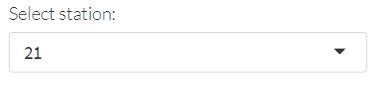

  
```{r setup, include=F}
knitr::opts_chunk$set(echo = F, message = F, warning = F)

# libraries
library(shiny)
library(flexdashboard)
library(mapview)
library(leaflet)
library(tidyverse)
library(sf)
library(plotly)
library(leafem)
library(RColorBrewer)
library(scales)
library(reactable)
library(tbeptools)
library(patchwork)
library(shinyWidgets)

source('R/funcs.R')

load('data/bswqdat.RData')
load('data/bswqdatsub.RData')
load('data/bsstatloc.RData')
load('data/rswqdat.RData')
load('data/rsstatloc.RData')
load('data/parms.RData')
load('data/bstransect.RData')
load('data/bstransectocc.RData')
load('data/trnpts.RData')
load('data/trnlns.RData')
load('data/rstrnpts.RData')
load('data/rstrnlns.RData')
load('data/rstrndatmcr.RData')
load('data/rstrndatsav.RData')
load('data/macrodat.RData')
load('data/rsbntpts.RData')
load('data/bswqrngs.RData')
load('data/rscntdat.RData')
load('data/rscntthr.RData')
load('data/rsphydat.RData')
load('data/rsphypts.RData')
load('data/wqrefmap.RData')

# logs
rswqlog <- readLines('https://tbep-tech.github.io/piney-point/logs/rswqlog.txt')
rscntlog <- readLines('https://tbep-tech.github.io/piney-point/logs/rscntlog.txt')
rsphylog <- readLines('https://tbep-tech.github.io/piney-point/logs/rsphylog.txt')
rstrnlog <- readLines('https://tbep-tech.github.io/piney-point/logs/rstrnlog.txt')

##
# globals

# map types
mptyps <- c("CartoDB.Positron", "CartoDB.DarkMatter", "OpenStreetMap", "Esri.WorldImagery", "OpenTopoMap")

# proj
prj <- 4326

# font
fml <- 'Lato Light'

# line colors on baseline
cols <- colorRampPalette(RColorBrewer::brewer.pal(n = 8, name = 'Set1'))(length(unique(bswqdat$var)))

# station colors on maps
stacols <- colorRampPalette(RColorBrewer::brewer.pal(n = 8, name = 'Accent'))(length(unique(rsstatloc$source_lng)))
names(stacols) <- sort(unique(rsstatloc$source_lng))

# variable color on wq maps
vrscols <- RColorBrewer::brewer.pal(n = 9, name = 'Blues')

# variable color on cnt maps
cntcols <- RColorBrewer::brewer.pal(n = 9, name = 'Purples')

# variable color on 
# value box colors
boxcol <- '#00806E'

# piney point loc
pineypoint <- c(-82.52469352586753, 27.629819505234703)

# map center
mapcenter <- c(-82.57862105363802, 27.624588580411267)

# seagrass transect prj
st_crs(trnpts) <- 4326

# baseline wq stations
bsstas <- unique(bsstatloc$station) %>% sort

# non-bay stations
nonbay <- c('BH01', 'P Port 2', 'P Port 3', 'PM Out', '20120409-01', 'PPC41', 'P Port 4', 'PMB01')

# seagrass species
spp <- c("Halodule", "Syringodium", "Thalassia", "Halophila", "Ruppia", "Caulerpa")

# seagrass transects near pp
trns <- sort(unique(bstransect$Transect))

# macroalgae transect near pp
rstrns <- sort(unique(rstrndatsav$station))

# benthic sites
rsbnts <- sort(unique(rsbntpts$station))

# phyto sites
rsphys <- sort(unique(rsphypts$station))

# sources lookup
srcs <- rsstatloc %>% 
  st_set_geometry(NULL) %>% 
  select(source_lng, source) %>% 
  unique

# variables to select from available
vrs <- parms %>% 
  select(lbs, var) %>% 
  filter(var %in% rswqdat$var) %>% 
  deframe %>% 
  as.list

# contaminant variables
cntvrs <- rscntdat %>% 
  pull(var) %>% 
  unique %>% 
  sort

# phy cell count range
phymax <- rsphydat %>% 
  pull(val) %>% 
  max(., na.rm = T) %>% 
  `/` (1000)
```

```{r statics}
# response sampling locations
rslocs <- rsstatloc %>% 
  mutate(
    lon = st_coordinates(.)[, 1],
    lat = st_coordinates(.)[, 2]
  ) %>% 
  st_set_geometry(NULL) %>% 
  select(
    `Data source` = source_lng, 
    `Station` = station, 
    Longitude = lon, 
    Latitude = lat
  )

# baseline wq map
tomap <- as.list(stacols) %>% 
  enframe('source', 'col') %>% 
  unnest(col) %>% 
  left_join(bsstatloc, ., by = 'source')
tomapcols <- tomap %>% 
  st_set_geometry(NULL) %>% 
  select(source, col) %>% 
  unique
bswqmap <- mapview(tomap, homebutton = F, layer.name = 'Data source', map.types = mptyps, legend = F) %>%
  .@map %>% 
  clearMarkers() %>% 
  addCircleMarkers(
    data = tomap,
    layerId = ~station,
    stroke = TRUE,
    color = 'black',
    fill = TRUE,
    fillColor = tomap$col,
    weight = 1,
    fillOpacity = 1,
    radius= 6, 
    label = ~paste0('Station: ', station)
  ) %>% 
  # addStaticLabels(
  #   data = tomap,
  #   label = tomap$station,
  #   direction = 'top',
  #   textsize = "20px", 
  #   offset = c(0, 1)
  # ) %>% 
  addCircleMarkers(
      data = tomap[tomap$station %in% bsstas[1], ],
      layerId = 'selsta',
      stroke = TRUE,
      color = 'black',
      fill = TRUE,
      fillColor = 'red',
      weight = 1,
      fillOpacity = 1,
      radius= 6, 
      label = ~paste0('Station: ', station)
    ) %>% 
  addMarkers(lng = pineypoint[1], lat = pineypoint[2], label = 'Piney Point') %>% 
  addLegend("topright", title = 'Data source', opacity = 1, labels = tomapcols$source, colors = tomapcols$col) 

# current base map
rscolsin <- rswqdat %>% 
  left_join(rsstatloc, by = 'source') %>% 
  pull(source_lng) %>% 
  unique %>% 
  sort %>% 
  stacols[.] 
rswqmap <- rsstatloc %>% 
  filter(station %in% rswqdat$station) %>% 
  mapview(zcol = 'source_lng', homebutton = F, layer.name = 'Data source', col.regions = rscolsin, map.types = mptyps, alpha.regions = 0.9) %>% 
  .@map %>% 
  addMarkers(lng = pineypoint[1], lat = pineypoint[2], label = 'Piney Point')

# summary of agencies reporting for value boxes
agns <- rswqdat %>% 
  pull(source) %>% 
  unique %>% 
  length

# summary of variables measured for value boxes
vars <- rswqdat %>% 
  pull(var) %>% 
  unique %>% 
  length

# summary of days of sampling for value boxes
dysm <- rswqdat %>% 
  pull(date) %>% 
  unique %>% 
  length

# summary of sites being monitored for value boxes
stsm <- rswqdat %>% 
  pull(station) %>% 
  unique %>% 
  length

# summary of samples for value boxes
smsm <- rswqdat %>% 
  nrow

# seagrass base map
bssgmap <- mapview(trnpts, homebutton = F, legend = F) %>% 
  .@map %>% 
  clearMarkers()
for(i in unique(trnlns$station))
  bssgmap <- bssgmap %>% 
    addPolylines(
      data = trnlns[trnlns$station %in% i, ], 
      lng = ~lng, 
      lat = ~lat, 
      color = 'grey', 
      label = ~station
    )
bssgmap <- bssgmap %>% 
  addCircleMarkers(
    data = trnpts,
    layerId = ~station,
    stroke = TRUE,
    color = 'black',
    fill = TRUE,
    fillColor = 'grey',
    weight = 1,
    fillOpacity = 1,
    radius= 4,
    label = ~paste0('Transect ', station)
  ) %>% 
  addStaticLabels(
    data = trnpts,
    label = trnpts$station, 
    direction = 'top', 
    textsize = '15px',
    offset = c(0, 1)
  ) %>% 
  addCircleMarkers(
    data = trnpts[trnpts$station %in% trns[1], ],
    layerId = 'seltrn',
    stroke = TRUE,
    color = 'black',
    fill = TRUE,
    fillColor = 'red',
    weight = 1,
    fillOpacity = 1,
    radius= 6,
    label = ~paste0('Transect ', station)
  ) %>% 
  addMarkers(lng = pineypoint[1], lat = pineypoint[2], label = 'Piney Point')

# rapid response transect base map
rstrnmap <- mapview(rstrnpts, homebutton = F, legend = F) %>% 
  .@map %>% 
  clearMarkers()
for(i in unique(rstrnlns$station))
  rstrnmap <- rstrnmap %>% 
    addPolylines(
      data = rstrnlns[rstrnlns$station %in% i, ], 
      lng = ~lng, 
      lat = ~lat, 
      color = 'grey', 
      label = ~paste0('Transect ', station, ' (', toupper(source), ')')
    )
rstrnmap <- rstrnmap %>% 
  addCircleMarkers(
    data = rstrnpts,
    layerId = ~station,
    stroke = TRUE,
    color = 'black',
    fill = TRUE,
    fillColor = 'grey',
    weight = 1,
    fillOpacity = 1,
    radius= 4,
    label = ~paste0('Transect ', station, ' (', toupper(source), ')')
  ) %>% 
  addStaticLabels(
    data = rstrnpts,
    label = rstrnpts$station, 
    direction = 'top', 
    textsize = '15px',
    offset = c(0, 1)
  ) %>% 
  addCircleMarkers(
      data = rstrnpts[rstrnpts$station %in% rstrns[1], ],
      layerId = 'seltrn',
      stroke = TRUE,
      color = 'black',
      fill = TRUE,
      fillColor = 'red',
      weight = 1,
      fillOpacity = 1,
      radius= 6,
      label = ~paste0('Transect ', station, ' (', toupper(source), ')')
    ) %>% 
  addMarkers(lng = pineypoint[1], lat = pineypoint[2], label = 'Piney Point') %>% 
  setView(mapcenter[1], mapcenter[2], zoom = 12)

# response benthic sampling base map
rsbntmap <- mapview(rsbntpts, homebutton = F, legend = F) %>% 
  .@map %>% 
  clearMarkers() %>% 
  addCircleMarkers(
    data = rsbntpts,
    layerId = ~station,
    stroke = TRUE,
    color = 'black',
    fill = TRUE,
    fillColor = 'grey',
    weight = 1,
    fillOpacity = 1,
    radius= 4,
    label = ~paste0('Station: ', station)
  ) %>% 
  addStaticLabels(
    data = rsbntpts,
    label = rsbntpts$station, 
    direction = 'top', 
    textsize = '15px',
    offset = c(0, 1)
  ) %>% 
  addCircleMarkers(
      data = rsbntpts[rsbntpts$station %in% rsbnts[1], ],
      layerId = 'selpt',
      stroke = TRUE,
      color = 'black',
      fill = TRUE,
      fillColor = 'red',
      weight = 1,
      fillOpacity = 1,
      radius= 6,
      label = ~paste0('Station: ', station)
    ) %>% 
  addMarkers(lng = pineypoint[1], lat = pineypoint[2], label = 'Piney Point')

# response phytoplankton sampling base map
phyleg <- rsphypts %>% 
  st_set_geometry(NULL) %>% 
  select(typ, col) %>% 
  unique
rsphymap <- mapview(rsphypts, homebutton = F, legend = F) %>% 
  .@map %>% 
  clearMarkers() %>%
  addCircleMarkers(
    data = rsphypts,
    layerId = ~station,
    stroke = TRUE,
    color = 'black',
    fill = TRUE,
    fillColor = rsphypts$col,
    weight = 1,
    fillOpacity = 1,
    radius= 4,
    label = ~paste0('Station: ', station)
  ) %>% 
  # addStaticLabels(
  #   data = rsphypts,
  #   label = rsphypts$station, 
  #   direction = 'top', 
  #   textsize = '15px',
  #   offset = c(0, 1)
  # ) %>% 
  addCircleMarkers(
    data = rsphypts[rsphypts$station %in% rsphys[1], ],
    layerId = 'selpt',
    stroke = TRUE,
    color = 'black',
    fill = TRUE,
    fillColor = 'red',
    weight = 1,
    fillOpacity = 1,
    radius= 6,
    label = ~paste0('Station: ', station)
  ) %>%  
  addMarkers(lng = pineypoint[1], lat = pineypoint[2], label = 'Piney Point') %>% 
  addLegend("topright", title = 'Data type', opacity = 1, labels = phyleg$typ, colors = phyleg$col) 
```

```{r reactives}
# water quality map, baseline data, bswqmap1
observe({
  
  # inputs
  stasel1 <- input$stasel1

  toadd <- bsstatloc %>% 
    filter(station %in% stasel1)

  mout <- leafletProxy('bswqmap1') %>%
    removeMarker('selsta') %>% 
    addCircleMarkers(
      data = toadd,
      layerId = 'selsta',
      stroke = TRUE,
      color = 'black',
      fill = TRUE,
      fillColor = 'red',
      weight = 1,
      fillOpacity = 1,
      radius= 6
    )
  
  return(mout)
})

# complete time series, baseline data
baseplo1 <- reactive({
  
  # inputs
  stasel1 <- input$stasel1
  
  out <- plo_fun(bswqdat, stasel1, cols, parms)
  
  return(out)
  
})

# march/april time series, baseline data
baseplo2 <- reactive({
  
  # inputs
  stasel1 <- input$stasel1
  
  out <- plo_fun(bswqdatsub, stasel1, cols, parms)
  
  return(out)
  
})

# variable range
varrng1 <- reactive({
  
  # input
  varsel1 <- input$varsel1
  rmvsta1 <- input$rmvsta1
  
  out <- rswqdat %>% 
    filter(var %in% varsel1) 
  
  if(rmvsta1)
    out <- out %>% 
      filter(!station %in% nonbay)
  
  validate(
    need(nrow(out) > 0, 'No data...')
  )
  
  out <- out %>% 
    pull(val) %>% 
    range(na.rm = T)
  
  return(out)
  
})

# color palette function
colfun <- reactive({
  
  # input
  varsel1 <- input$varsel1
  varrng1 <- varrng1()
  
  req(varrng1)
  
  # color palette function
  out <- colorNumeric(
    palette = vrscols,
    na.color = 'yellow',
    domain = varrng1
    )
  
  return(out)
  
})

# response wq data
rsdat1 <- reactive({
  
  # input
  varsel1 <- input$varsel1
  dyssel1 <- input$dyssel1
  mapsel1 <- input$mapsel1
  rmvsta1 <- input$rmvsta1
  colfun <- colfun()
  
  req(colfun)
  
  out <- rswqdat %>% 
    filter(var %in% varsel1) 

  if(rmvsta1)
    out <- out %>% 
      filter(!station %in% nonbay)

  # colors
  out <- out %>% 
    mutate(
      cols = colfun(val)
    ) 
 
  # sizes
  out$cexs <- scales::rescale(out$val, to = c(4, 17))
  
  # filter by day if provided
  if(mapsel1){
    
    out <- out %>% 
      filter(date %in% dyssel1)
    
  }
  
  return(out)
  
})

# response wq data table
rstab1 <- reactive({
  
  # input
  rsdat1 <- rsdat1()
  rngemph <- input$rngemph
  varsel1 <- input$varsel1
  rngsel1 <- input$rngsel1
  
  # variable label
  vrlb <- names(vrs)[vrs == varsel1]
  
  totab <- rsdat1 %>% 
    left_join(parms, by = 'var') %>% 
    left_join(srcs, by = 'source') %>% 
    select(
      Source = source_lng,
      Station = station ,
      Date = date, 
      `Reference station` = bswqstation, 
      `Normal range` = nrmrng,
      `In normal range?` = inrng,
      val 
    ) %>% 
    arrange(desc(Date))
  names(totab)[names(totab) == 'val'] <- vrlb
  
  # do not emphasize out of range
  if(!rngemph)
    out <- reactable(totab,
      defaultColDef = colDef(
        footerStyle = list(fontWeight = "bold"),
        format = colFormat(separators = F),
        resizable = TRUE, 
        align = 'left'
      ),
      filterable = T,
      defaultPageSize = nrow(totab)
      )
  
  # emphasize out or range
  if(rngemph){
    
    req(rngsel1)
    
    if(rngsel1 == 'above')
      out <- reactable(totab,
        defaultColDef = colDef(
          footerStyle = list(fontWeight = "bold"),
          format = colFormat(separators = F),
          resizable = TRUE, 
          align = 'left'
        ),
        filterable = T,
        defaultPageSize = nrow(totab),
        rowStyle = JS("function(rowInfo) {
          if (rowInfo.row['In normal range?'] == 'above') {
            return { background: 'rgba(0, 0, 0, 0.05)' }
          }
        }"),
        rowClass = JS("function(rowInfo) {
          if (rowInfo.row['In normal range?'] == 'above') {
            return 'bold'
          }
        }")
      )
    
    if(rngsel1 == 'below')  
      out <- reactable(totab,
        defaultColDef = colDef(
          footerStyle = list(fontWeight = "bold"),
          format = colFormat(separators = F),
          resizable = TRUE, 
          align = 'left'
        ),
        filterable = T,
        defaultPageSize = nrow(totab),
        rowStyle = JS("function(rowInfo) {
          if (rowInfo.row['In normal range?'] == 'below') {
            return { background: 'rgba(0, 0, 0, 0.05)' }
          }
        }"),
        rowClass = JS("function(rowInfo) {
          if (rowInfo.row['In normal range?'] == 'below') {
            return 'bold'
          }
        }")
      )
    
  }
  
  return(out)
  
})

# response wq data map
rsmap1 <- reactive({
  
  # input
  rsdat1 <- rsdat1()
  colfun <- colfun()
  varrng1 <- varrng1()
  varsel1 <- input$varsel1
  rngemph <- input$rngemph
  rngsel1 <- input$rngsel1
  
  req(rsdat1)

  # variable label
  vrlb <- names(vrs)[vrs == varsel1]

  # make sf
  tomap <- rsdat1 %>% 
    inner_join(rsstatloc, ., by = c('source', 'station'))

  leglab <- vrlb

  if(nrow(tomap) == 0)
    m <- mapview()
  
  # show all equally 
  if(nrow(tomap) != 0 & !rngemph){
    
    # hover pt labels
    labs <- paste0('Station: ', tomap$station, ', Date: ', tomap$date, ', ', vrlb, ': ', round(tomap$val, 2))
  
    m <- mapview(tomap, cex = tomap$cexs, label = labs, legend = F, layer.name = F, col.regions = tomap$cols, homebutton = F, map.types = mptyps)
    
  }
  
  # emphasize out of range
  if(nrow(tomap) != 0 & rngemph){
    
    req(rngsel1)
    
    tomap1 <- tomap %>% filter(inrng != !!rngsel1)
    tomap2 <- tomap %>% filter(inrng == !!rngsel1)
    
    # hover pt labels
    labs1 <- paste0('Station: ', tomap1$station, ', Date: ', tomap1$date, ', ', vrlb, ': ', round(tomap1$val, 2))
    labs2 <- paste0('Station: ', tomap2$station, ', Date: ', tomap2$date, ', ', vrlb, ': ', round(tomap2$val, 2))

    if(nrow(tomap1) == 0)
      m <- mapview(tomap2, cex = tomap2$cexs, label = labs2, legend = F, layer.name = F, col.regions = tomap2$cols, homebutton = F, map.types = mptyps)
  
    if(nrow(tomap2) == 0)
      m <- mapview(tomap1, cex = tomap1$cexs, label = labs1, legend = F, layer.name = F, col.regions = tomap1$cols, homebutton = F, map.types = mptyps, lwd = 0)
    
    if(nrow(tomap1) > 0 & nrow(tomap2) > 0)
      m <- mapview(tomap1, cex = tomap1$cexs, label = labs1, legend = F, layer.name = F, col.regions = tomap1$cols, homebutton = F, map.types = mptyps, lwd = 0) +
        mapview(tomap2, cex = tomap2$cexs, label = labs2, legend = F, layer.name = F, col.regions = tomap2$cols, homebutton = F, map.types = mptyps)
    
  }
  
  # add legend
  out <- m@map %>% 
    addLegend("bottomright", pal = colfun, title = leglab, opacity = 1, values = varrng1) %>% 
    setView(mapcenter[1], mapcenter[2], zoom = 11) %>% 
    addMarkers(lng = pineypoint[1], lat = pineypoint[2], label = 'Piney Point')
  
  return(out)
  
})

# contaminant variable range
cntrng1 <- reactive({
  
  # input
  cntsel1 <- input$cntsel1
  rmvsta2 <- input$rmvsta2
  
  out <- rscntdat %>% 
    filter(var %in% cntsel1) 

  if(rmvsta2)
    out <- out %>% 
      filter(!station %in% nonbay)
  
  validate(
    need(nrow(out) > 0, 'No data...')
  )
  
  out <- out %>% 
    pull(val) %>% 
    range(na.rm = T)
  
  return(out)
  
})

# contaminant color palette function
cntcolfun <- reactive({
  
  # input
  cntsel1 <- input$cntsel1
  cntrng1 <- cntrng1()
  
  req(cntrng1)
  
  # color palette function
  out <- colorNumeric(
    palette = cntcols,
    na.color = 'yellow',
    domain = cntrng1
    )
  
  return(out)
  
})

# response contaminant data
rscntdat1 <- reactive({
  
  # input
  cntsel1 <- input$cntsel1
  dyssel2 <- input$dyssel2
  mapsel2 <- input$mapsel2
  rmvsta2 <- input$rmvsta2
  cntcolfun <- cntcolfun()
  
  req(cntcolfun)
  
  out <- rscntdat %>% 
    filter(var %in% cntsel1) 
  
  if(rmvsta2)
    out <- out %>% 
      filter(!station %in% nonbay)
    
  out <- out %>% 
    mutate(
      cols = cntcolfun(val)
    ) 
 
  # sizes
  out$cexs <- scales::rescale(out$val, to = c(4, 17))
  
  # filter by day if provided
  if(mapsel2){

    out <- out %>% 
      filter(date %in% dyssel2)
    
  }
  
  return(out)
  
})

# response contamint variable threshold\
rscnttxt1 <- reactive({
  
  # input
  cntsel1 <- input$cntsel1

  tmp <- rscntthr %>% 
    filter(var == !!cntsel1) 
  
  if(is.na(tmp$thresh))
    txt <- "no threshold"
  
  if(!is.na(tmp$thresh))
    txt <- paste0(tmp$thresh, ' (', tmp$uni, ')')
  
  out <- HTML(paste('Relevant threshold (see information tab):<b>', txt, '</b><br></br>'))
  
  return(out)
  
})

# response contaminant data table
rscnttab1 <- reactive({
  
  # input
  rscntdat1 <- rscntdat1()
  cntsel1 <- input$cntsel1
  thremph <- input$thremph

  totab <- rscntdat1 %>% 
    select(
      Station = station ,
      Date = date, 
      val, 
      `Above threshold?` = inrng
    ) %>% 
    arrange(desc(Date))
  names(totab)[names(totab) == 'val'] <- cntsel1
  
  # do not emphasize out of range
  if(!thremph)
    out <- reactable(totab,
      defaultColDef = colDef(
        footerStyle = list(fontWeight = "bold"),
        format = colFormat(separators = F),
        resizable = TRUE, 
        align = 'left'
      ),
      filterable = T,
      defaultPageSize = nrow(totab)
      )
  
  # emphasize out or range  
  if(thremph)  
    out <- reactable(totab,
      defaultColDef = colDef(
        footerStyle = list(fontWeight = "bold"),
        format = colFormat(separators = F),
        resizable = TRUE, 
        align = 'left'
      ),
      filterable = T,
      defaultPageSize = nrow(totab),
      rowStyle = JS("function(rowInfo) {
        if (rowInfo.row['Above threshold?'] == 'above') {
          return { background: 'rgba(0, 0, 0, 0.05)' }
        }
      }"),
      rowClass = JS("function(rowInfo) {
        if (rowInfo.row['Above threshold?'] == 'above') {
          return 'bold'
        }
      }")
    )
  
  return(out)
  
})

# response data map
rscntmap1 <- reactive({
  
  # input
  rscntdat1 <- rscntdat1()
  cntcolfun <- cntcolfun()
  cntrng1 <- cntrng1()
  cntsel1 <- input$cntsel1
  thremph <- input$thremph
  
  req(nrow(rscntdat1) > 0)

  # make sf
  tomap <- rscntdat1 %>% 
    inner_join(rsstatloc, ., by = c('source', 'station'))

  leglab <- cntsel1
  vrlb <- cntsel1
  
  if(nrow(tomap) == 0)
    m <- mapview()

  # no threshold emphasis
  if(nrow(tomap) != 0 & !thremph){
    
    # hover pt labels
    labs <- paste0('Station: ', tomap$station, ', Date: ', tomap$date, ', ', cntsel1, ': ', round(tomap$val, 2))
  
    m <- mapview(tomap, cex = tomap$cexs, label = labs, legend = F, layer.name = F, col.regions = tomap$cols, homebutton = F, map.types = mptyps)
    
  }
    
  # threshold emphasis
  if(nrow(tomap) != 0 & thremph){

    # check if no threshold
    chk <- any(tomap$inrng %in% 'no threshold')
    
    # exit if no threshold
    if(chk){
      
      # hover pt labels
      labs <- paste0('Station: ', tomap$station, ', Date: ', tomap$date, ', ', cntsel1, ': ', round(tomap$val, 2))
      
      m <- mapview(tomap, cex = tomap$cexs, label = labs, legend = F, layer.name = F, col.regions = tomap$cols, homebutton = F, map.types = mptyps)
          
    }

    if(!chk){
      
      tomap1 <- tomap %>% filter(inrng == 'below')
      tomap2 <- tomap %>% filter(inrng == 'above')
    
      # hover pt labels
      labs1 <- paste0('Station: ', tomap1$station, ', Date: ', tomap1$date, ', ', vrlb, ': ', round(tomap1$val, 2))
      labs2 <- paste0('Station: ', tomap2$station, ', Date: ', tomap2$date, ', ', vrlb, ': ', round(tomap2$val, 2))
  
      if(nrow(tomap1) == 0)
        m <- mapview(tomap2, cex = tomap2$cexs, label = labs2, legend = F, layer.name = F, col.regions = tomap2$cols, homebutton = F, map.types = mptyps)
    
      if(nrow(tomap2) == 0)
        m <- mapview(tomap1, cex = tomap1$cexs, label = labs1, legend = F, layer.name = F, col.regions = tomap1$cols, homebutton = F, map.types = mptyps, lwd = 0)
      
      if(nrow(tomap1) > 0 & nrow(tomap2) > 0)
        m <- mapview(tomap1, cex = tomap1$cexs, label = labs1, legend = F, layer.name = F, col.regions = tomap1$cols, homebutton = F, map.types = mptyps, lwd = 0) +
          mapview(tomap2, cex = tomap2$cexs, label = labs2, legend = F, layer.name = F, col.regions = tomap2$cols, homebutton = F, map.types = mptyps)
      
    }    
    
  }
  
  # add legend
  out <- m@map %>% 
    addLegend("bottomright", pal = cntcolfun, title = leglab, opacity = 1, values = cntrng1) %>% 
    setView(mapcenter[1], mapcenter[2], zoom = 11) %>% 
    addMarkers(lng = pineypoint[1], lat = pineypoint[2], label = 'Piney Point')
  
  return(out)
  
})

# seagrass map selection, bssgmap1
observe({
  
  # input
  trnsel1 <- input$trnsel1
  
  toadd <- trnpts %>% 
    filter(station %in% trnsel1)
  mout <- leafletProxy('bssgmap1') %>% 
    removeMarker('seltrn') %>% 
    addCircleMarkers(
      data = toadd,
      layerId = 'seltrn',
      stroke = TRUE,
      color = 'black',
      fill = TRUE,
      fillColor = 'red',
      weight = 1,
      fillOpacity = 1,
      radius= 6,
      label = ~paste0('Transect ', station)
    ) 
  
  return(mout)
  
})

# seagrass transect plot over time
bssgtrnplo1 <- reactive({
  
  # input
  trnsel1 <- input$trnsel1
  
  p <- show_transect(bstransect, site = trnsel1, species = spp, varplo = 'Abundance', plotly = T, base_size = 11, yrrng = c(1998, 2021)) %>% 
    layout(
      title = list(text = NA), 
      legend = list(title = list(text = 'Abundance (BB)'))
    )
  
  
  return(p)
  
})

# seagrass summary plot over time
bssgsumplo1 <- reactive({
  
  # input
  trnsel1 <- input$trnsel1
  
  p <- show_transectsum(bstransectocc, site = trnsel1, species = spp, yrrng = c(1998, 2021)) %>% 
    layout(
      title = list(text = NA),
      legend = list(title = list(text = NA)),
      xaxis = list(title = list(text = 'Year'))
    )
  
  return(p)
  
})

# rapid response transect map selection, rstrnmap1
observe({
  
  # input
  trnsel2 <- input$trnsel2
  
  toadd <- rstrnpts %>% 
    filter(station %in% trnsel2)
  mout <- leafletProxy('rstrnmap1') %>% 
    removeMarker('seltrn') %>% 
    addCircleMarkers(
      data = toadd,
      layerId = 'seltrn',
      stroke = TRUE,
      color = 'black',
      fill = TRUE,
      fillColor = 'red',
      weight = 1,
      fillOpacity = 1,
      radius= 6,
      label = ~paste0('Transect ', station, ' (', toupper(source), ')')
    ) 
  
  return(mout)
  
})

# rapid response sav selection
rstrnsavsel <- reactive({
  
  # input
  trnsel2 <- input$trnsel2

  out <- rstrndatsav %>% 
    filter(station %in% !!trnsel2) %>% 
    filter(sav_bb > 0) %>% 
    pull(sav_species) %>% 
    unique %>% 
    as.character
  
  return(out)
  
})

# rapid response mcr selection
rstrnmcrsel <- reactive({
  
  # input
  trnsel2 <- input$trnsel2
  
  out <- rstrndatmcr %>% 
    filter(station %in% !!trnsel2) %>% 
    filter(macroalgae_bb > 0) %>% 
    pull(macroalgae_species) %>% 
    unique %>% 
    as.character
  
  return(out)
  
})

# rapid response transect plot
rstrnplo1 <- reactive({
  
  # input
  trnsel2 <- input$trnsel2
  savsel <- input$savsel
  mcrsel <- input$mcrsel
  rstrnsavsel <- rstrnsavsel()

  req(!is.null(mcrsel) | !is.null(savsel))
  
  p <- show_rstransect(rstrndatsav, rstrndatmcr, station = trnsel2, savsel = savsel, mcrsel = mcrsel, base_size = 18) 
 
  return(p)
  
})

# rapid response benthic map selection, rsbntmap1
observe({
  
  # input
  stasel2 <- input$stasel2
  
  toadd <- rsbntpts %>% 
    filter(station %in% stasel2)
  mout <- leafletProxy('rsbntmap1') %>% 
    removeMarker('selpt') %>% 
    addCircleMarkers(
      data = toadd,
      layerId = 'selpt',
      stroke = TRUE,
      color = 'black',
      fill = TRUE,
      fillColor = 'red',
      weight = 1,
      fillOpacity = 1,
      radius= 6,
      label = ~paste0('Station: ', station)
    ) 
  
  return(mout)
  
})

# rapid response phyto map selection, rsphymap1
observe({
  
  # input
  stasel3 <- input$stasel3
  
  toadd <- rsphypts %>% 
    filter(station %in% stasel3)
  mout <- leafletProxy('rsphymap1') %>%
    removeMarker('selpt') %>% 
    addCircleMarkers(
      data = toadd,
      layerId = 'selpt',
      stroke = TRUE,
      color = 'black',
      fill = TRUE,
      fillColor = 'red',
      weight = 1,
      fillOpacity = 1,
      radius= 6,
      label = ~paste0('Station: ', station)
    ) 
  
  return(mout)
  
})

# rapid response phyto data
rsphydat1 <- reactive({
  
  # input
  stasel3 <- input$stasel3

  phyout <- rsphydat %>% 
    filter(station %in% stasel3) %>% 
    left_join(srcs, by = 'source')
  
  wqout <- rswqdat %>% 
    filter(station %in% stasel3) %>% 
    left_join(srcs, by = 'source')
  
  out <- list(
    wq = wqout, 
    phy = phyout
  )
  
  return(out)
  
})

# rapid response phyto text
rsphytxt1 <- reactive({
  
  # inputs
  rsphydat1 <- rsphydat1()

  typ <- unique(rsphydat1$phy$typ)
  
  out <- paste0(typ, ' algae samples')
  
  if(nrow(rsphydat1$wq) == 0)
    out <- paste0(out, ', no water quality data')
  
  out <- HTML(paste0('<b>', out, '</b><br></br>'))
  
  return(out)
  
})

# rapid response phyto plot
rsphyplo1 <- reactive({
  
  # inputs
  rsphydat1 <- rsphydat1()

  phydat <- rsphydat1$phy
  
  typ <- phydat %>% 
    pull(typ) %>% 
    unique
  
  out <- NULL
  if(typ == 'Quantitative'){
    
    toplo <- phydat %>% 
      select(date, species, val, valqual) %>% 
      complete(species, date, fill = list(val = 0, valqual = 'Very low'))
    
    levs <- toplo %>% 
      filter(date == min(date)) %>% 
      arrange(val) %>% 
      pull(species)
    
    toplo <- toplo %>% 
      mutate(
        species = factor(species, levels = levs),
        val = val / 1000
        ) %>% 
      filter(val != 0)
    
    cols <- RColorBrewer::brewer.pal(length(levels(toplo$valqual)) - 1, 'Greens')
    cols <- c('white', cols)
    
    out <- ggplot(toplo, aes(y = species, x = val)) + 
      geom_bar(stat = 'identity', aes(fill = valqual), colour = 'black') + 
      scale_x_continuous(expand = c(0, 0), limits = c(0, phymax)) +
      scale_fill_manual(values = cols, drop = F) +
      facet_wrap(~date) + 
      theme_minimal(base_size = 16) + 
      theme(
        legend.position = 'top', 
        legend.title = element_blank(), 
        strip.background = element_blank(), 
        axis.title.y = element_blank()
        ) + 
      labs(
        x = '1000 x cells/L'
      )

  }
  
  return(out)
  
})

# rapid response phyto table
rsphytab1 <- reactive({
  
  # inputs
  rsphydat1 <- rsphydat1()

  phydat <- rsphydat1$phy
  
  typ <- phydat %>% 
    pull(typ) %>% 
    unique
  
  out <- NULL
  if(typ == 'Qualitative') 
    out <- phydat %>% 
      mutate(
        source_lng = case_when(
          source_lng %in% c('Florida DEP', 'USF') ~ 'FWC-FWRI', 
          T ~ source_lng
        )
      ) %>% 
      select(
        Source = source_lng,
        Station = station,
        Date = date, 
        `Taxa observed` = species
        ) %>% 
      unique %>%
      arrange(desc(Date)) %>% 
      reactable()
  
  return(out)
  
})

# response wq data table to accompany phyto
rstab2 <- reactive({
  
  # input
  rsphydat1 <- rsphydat1()
  varsel2 <- input$varsel2
  
  req(varsel2)
  
  # variable label
  vrlb <- names(vrs)[vrs == varsel2]
  
  totab <- rsphydat1$wq %>% 
    filter(var %in% !!varsel2) %>% 
    left_join(parms, by = 'var') %>% 
    select(
      Source = source_lng,
      Station = station,
      Date = date, 
      `Reference station` = bswqstation, 
      `Normal range` = nrmrng,
      `In normal range?` = inrng,
      val 
    ) %>% 
    arrange(desc(Date))
  names(totab)[names(totab) == 'val'] <- vrlb
  
  out <- reactable(totab,
    defaultColDef = colDef(
      footerStyle = list(fontWeight = "bold"),
      format = colFormat(separators = F),
      resizable = TRUE, 
      align = 'left'
    ),
    defaultPageSize = nrow(totab)
  )
  
  return(out)
  
})
```

OVERVIEW {data-orientation=rows}
=======================================================================

Row
-------------------------------------

### __DASHBOARD INFORMATION__

<div class = "row">
<div class = "col-md-1"></div>
<div class = "col-md-10">

```{r out.width='100%', fig.align='center'}
knitr::include_graphics('www/Piney_Dashboard_Header.png')
```

[__JUMP TO LATEST DATA__](#water-quality-results), last water quality update `r rswqlog`

From March 30th to April 9th, approximately 215 million gallons of wastewater from Piney Point were released into Tampa Bay.  The Tampa Bay Estuary Program is working with regional partners to coordinate and synthesize water quality, benthic, seagrass, and fisheries monitoring data. We are also consulting with USF to model forecasted plume trajectory from the Piney Point discharge. 

The primary pollutants of concern for this discharge are phosphorus and nitrogen (primarily ammonia nitrogen), which may stimulate an algae response and cause adverse effects on seagrass, fish, and other wildlife.

The dashboard is a synthesis of data that can be used to assess baseline conditions prior to discharge and to evaluate changing water quality conditions as new data become available.  __All data are provisional and subject to revision.__ The dashboard is arranged as follows:

1) __CURRENT DATA__: Current [water quality](#water-quality-results), [algal surveys](#algal-surveys), [seagrass/macroalgae](https://shiny.tbep.org/piney-point/#section-rapid-response-seagrassmacroalgae-surveys), and [contaminant](#contaminant-results) results are presented.  [Sediment](#benthic-surveys) (biology and chemistry) samples have also been collected, but the data are being processed.
1) __BASELINE DATA__: Long-term [water quality](#water-quality) and [seagrass data](#seagrasses) over a 25 year period.  

#### Additional resources

* Florida DEP Piney Point regional notification: [link](https://protectingfloridatogether.gov/PineyPointUpdate){target="_blank"}
* USF Piney Point circulation modeling: [link](http://ocgweb.marine.usf.edu/~liu/Tracer/){target="_blank"}
* NOAA algal bloom satellite imagery: [link](https://coastalscience.noaa.gov/research/stressor-impacts-mitigation/hab-monitoring-system/red-tide-from-satellite-for-southwest-florida/tampa-bay/){target="_blank"}
* USF Optical Oceanography Lab algal bloom satellite imagery: [link](https://optics.marine.usf.edu/cgi-bin/animation?productSensor=MPH.olcis3a&amp;animateFrom=03/29/2021&amp;animateTo=04/30/2021&amp;roi=CWFL){target="_blank"}

#### Website information

The page source content can be viewed on [Github](https://github.com/tbep-tech/piney-point).

Questions and comments about the dashboard can be sent to [Marcus Beck](mailto:mbeck@tbep.org).

<a rel='license' href='http://creativecommons.org/licenses/by/4.0/'></a>&nbsp;&nbsp;This dashboard is licensed under a <a rel='license' href='http://creativecommons.org/licenses/by/4.0/'>Creative Commons Attribution 4.0 International License</a>.

[](https://zenodo.org/badge/latestdoi/353409644)

</div>
<div class = "col-md-1"></div>
</div>

### __LOCATIONS WITH DATA - PINEY POINT AT MARKER__ 

```{r}
rswqmap
```

Row
-----------------------------------------------------------------------

### 

```{r}
valueBox(agns, 'Agencies reporting', color = boxcol, icon = 'fa-university')
```

### 

```{r}
valueBox(vars, 'Parameters monitored', color = boxcol, icon = 'fa-vial')
```

### 

```{r}
valueBox(dysm, 'Days of sampling', color = boxcol, icon = 'fa-calendar')
```

### 

```{r}
valueBox(stsm, 'Sites with data', color = boxcol, icon = 'fa-map-marked')
```

### 

```{r}
valueBox(smsm, 'Measurements available', color = boxcol, icon = 'fa-tint')
```


WATER QUALITY RESULTS {data-navmenu="CURRENT DATA"}
=======================================================================

Column {data-width=400}
-----------------------------------------------------------------------

### __STATION LOCATIONS - PINEY POINT AT MARKER__

```{r}
output$rsmap1 <- renderLeaflet(rsmap1())
leafletOutput('rsmap1')
```

Column {.tabset .tabset-fade}
-----------------------------------------------------------------------

<br>
```{r}
column(12,
  column(3, HTML('<b>ALL DATA ARE PROVISIONAL</b><br></br>')),
  column(9,
    materialSwitch(inputId = 'rmvsta1', label = 'Remove stations on land near Piney Point (these can skew in-bay results)?', width = '100%')
  )
)
column(12,
  column(3, 
    selectInput('varsel1', HTML('<b>Select variable:</b>'), choices = vrs, selected = 'nh34')       
  ), 
  column(3, 
    materialSwitch(inputId = 'mapsel1', label = 'Map results by date?', width = '100%')
    ),
  column(6, 
    renderUI({
      
      # inputs
      varsel1 <- input$varsel1
      mapsel1 <- input$mapsel1
 
      if(!mapsel1)
        return(NULL)
      
      dys <- rswqdat %>% 
        filter(var %in% varsel1) %>% 
        pull(date) %>% 
        unique
      
      sliderInput('dyssel1', 'Select date:', min = min(dys), max = max(dys), value = max(dys), animate = T, timeFormat="%m-%d", width = '100%')
  
    })     
  )
)
column(12, 
  column(3,
    HTML('<br></br>')
  ), 
  column(9,
    fillRow(
    materialSwitch(inputId = 'rngemph', label = 'Emphasize results out of normal range?', width = '100%'),
    renderUI({
      
      # input
      rngemph <- input$rngemph
      
      if(rngemph)
        selectInput('rngsel1', NULL, choices = c('above', 'below'), selected = 'above')
      
    })
  )
))
```

### __TABLE DATA__

```{r}
output$rstab1 <- renderReactable(rstab1())
reactableOutput('rstab1')
```

### __INFORMATION__

Use the variable selection menu on the top to view results for a measured water quality parameter of interest.  The map on the left will show results at locations that have been sampled for the parameter, with the same results shown in the table.  All points on the map are sized and colored by the range of values in the data for the selected parameter and based on the selected viewing options.  There are a few options for how the results are shown in the map and table: 

1. You can choose to show all samples or remove those that are on land near Piney Point (i.e., creeks or other discharge points where wastewater is leaving the holding ponds).  Removing sampling stations on land will typically shift the color and sizing on the map to a narrower range that provides a better representation of impacts in the bay. 
1. You can choose to show all dates or filter by a particular date. If results are filtered by date, hit the "play" button below the date slider to view a time lapse of data. The data table will show only results for the selected day.
1. You can choose to emphasize results that are out of the normal range of values for the March/April period in Tampa Bay.  Points within the normal range will no longer be outlined on the map, making those outside of range easier to view.  The same values that are out of range will be highlighted in the table.  The "normal range" is based on the long-term March/April average plus and minus 1 standard deviation of the mean for each parameter.  The long-term values that are compared to the current results are from baseline data at the long-term station nearest to the current water quality station.  See the [REFERENCE STATIONS](https://shiny.tbep.org/piney-point/#section-reference-stations) map to view the current water quality stations relative to the reference stations used to establish the normal range.  The station used as reference for the normal range is shown in the table, together wiht the estimated normal range. __The normal ranges change by location.__

How are the data interpreted? 

As of `r rswqlog`, data from `r vars` parameters and `r agns` agencies have been added to this dashboard.  These parameters were chosen primarily to track the flow of nutrients from wastewater being discharged into the bay.  The primary environmental threat is an algae response as a result of high concentrations of nutrients in this wastewater. Excess algal can have adverse effects on seagrass, fish, and other wildlife.  __Nitrogen, either total nitrogen (TN) or total ammonia nitrogen (NH3, NH4+), is the primary concern for tracking potential impacts of discharge from Piney Point.__

The parameters being monitored include: 

__Chlorophyll-a (ug/L)__: Chlorophyll is present in algal tissue and concentrations in the water column provide a measure of algae production. 

__Color (PCU)__: Water color in platinum cobalt units, changes in color can suggest a wastewater or stormwater source with different characteristics from ambient conditions. Higher PCU means darker waters.

__BOD (mg/L)__: Biological (or biochemical) oxygen demand (mg/L) as a measure of the amount of oxygen consumed by microorganisms in decomposing organic matter or the chemical oxidation of inorganic matter.  Higher BOD may indicate higher productivity associated with an algal bloom.

__DO (mg/L)__: A measure of dissolved oxygen in the water column as a concentration (mg/L). Low dissolved oxygen less than 3 mg/L may indicate hypoxic conditions potentially harmful to biological organisms.

__DO (% saturation)__: A measure of dissolved oxygen in the water column as percent saturation. Low percent saturation less than 30 %  may indicate hypoxic conditions potentially harmful to biological organisms. Supersaturated values (>100%) indicate enhanced algal or seagrass primary production.

__NH3, NH4+ (mg/L)__: Total ammonia nitrogen concentration as a component of total nitrogen, includes unionized ammonia (NH3) and ionized ammonium (NH4+).  Excess total ammonia nitrogen can stimulate algal production.

__Nitrate/Nitrite (mg/L)__: Nitrate/nitrite concentration as a component of total nitrogen.  Excess nitrate/nitrite can stimulate algal production.

__Ortho-P (mg/L)__: Orthophosphate concentration as a component of total phosphorus. Excess orthophosphate can stimulate algal production, although this is less of a concern than nitrogen in Tampa Bay.

__pH__: pH as a measure of water acidity. Normal estuary acidity ranges from 7 - 8.5.  Lower pH values can harm plants and wildife in the Bay. 

__Sal (ppt)__: Salinity in parts per thousand.  Estuaries can range from 0 when dominated by freshwater inflows to >32 when dominated by Gulf tidal inflows. Lower salinities can indicate a strong freshwater source, potentially from wastewater or other natural sources.

__Secchi (m)__: Secchi depth as a measure of water clarity. Higher values mean clearer water.  Lower values may indicate high algae production.

__Temp (C)__: Water temperature. 

__TKN (mg/L)__: Total Kjeldahl nitrogen concentration as a component of total nitrogen. TKN is the sum of ammonia, organic, and reduced nitrogen.  Excess TKN can stimulate algal production.

__TN (mg/L)__: Total nitrogen concentration is the sum of TKN (ammonia, organic, and reduced nitrogen) and nitrate/nitrite. Excess total nitrogen can stimulate algal production.

__TP (mg/L)__: Total phosphorus concentration is the sum of orthophosphate, condensed phosphate, and organic phosphate. Excess total phosphorus can stimulate algal production, although this is less of a concern than nitrogen in Tampa Bay.

__TSS (mg/l)__: Total suspended solids is a general measure of water clarity that includes silt and clay particles, plankton, algae, fine organic matter, and other particulate matter. Higher values can indicate algal response or other matter from external sources. 

### __REFERENCE STATIONS__

```{r}
wqrefmap@map
```


ALGAL SURVEYS {data-navmenu="CURRENT DATA"}
=======================================================================

Column {data-width=400}
-----------------------------------------------------------------------

### __STATION LOCATIONS - PINEY POINT AT MARKER__, last update `r rsphylog`

```{r}
output$rsphymap1 <- renderLeaflet(rsphymap)
leafletOutput('rsphymap1')
```

Column {data-width=650 .tabset .tabset-fade}
-----------------------------------------------------------------------

<br>
```{r}
column(12, 
  column(4, 
    selectInput(inputId = 'stasel3', label = HTML('<b>Select station (hover on map for names):</b>'), choices = rsphys, selected = rsphys[1])
    ), 
  column(4,
    renderUI({

      # inputs
      rsphydat1 <- rsphydat1()

      req(nrow(rsphydat1$wq) > 0)
      
      tosel <- rsphydat1$wq %>%
        select(var) %>%
        left_join(parms, by = 'var') %>%
        select(lbs, var) %>%
        unique %>%
        deframe %>%
        as.list

      selectInput('varsel2', HTML('<b>Select water quality variable:</b>'), choices = tosel, selected = tosel[1])

    })
  )
)
column(12,
  column(4, 
    renderUI(rsphytxt1())
  )
)
```

### __SUMMARY__

```{r}
output$rsphyplo1 <- renderPlot(rsphyplo1())
output$rsphytab1 <- renderReactable(rsphytab1())
output$rstab2 <- renderReactable(rstab2())
output$physum1 <- renderUI({
  
  # input
  rsphydat1 <- rsphydat1()
  
  typ <- rsphydat1$phy %>% 
    pull(typ) %>% 
    unique
  
  if(typ == 'Quantitative'){
    plotOutput('rsphyplo1')
  } else {
    if(typ == 'Qualitative')
      reactableOutput('rsphytab1')
  }
  
})
fillCol(flex = c(NA, 1, NA, 0.5),
  HTML('<b>Algal results</b>'),
  uiOutput('physum1'), 
  HTML('<b>Paired water quaility results</b>'),
  reactableOutput('rstab2')
)
```

### __INFORMATION__

This tab shows results of phytoplankton (algae) surveys provided from different sources.  The data are either qualitative (e.g., description of taxa observed at a site) or quantitative (counts of taxa observed at a site) depending on the data source.  Phytoplankton are also collected at many, but not all, of the same stations where water quality samples are collected, which allows a comparison of both to determine potential associations between water quality (e.g., nutrient concentrations) and changes in the algal community.  

Select the station to view from the menu on the top.  The station map on the left shows which stations provide qualitative or quantitative data.  If a qualitative station is selected, a tabular summary of species observed by date will be shown.  If a quantitative station is selected, a plot of algal cell counts (a measure of abundance) by date will be shown.  The cell counts are categorized into relative amounts (Very low, Low, etc.) following breakpoints used by FWC-FWRI for *Karenia brevis* ([https://myfwc.com/research/redtide/statewide/](https://myfwc.com/research/redtide/statewide/)).  Note that these breakpoints may not have ecological relevance for algal taxa in Lower Tampa Bay and are only provided as guidelines to assess relative differences.  Results for nanoplankton have been removed because of typically high concentrations that cannot be enumerated in the lab.  

For all stations, water quality data collected at the station will also be shown in a table below the algal results, if available.  You can choose which water quality variable is shown from the selection menu at the top. 

Stations on the map that have different names but occur at the same location are slightly offset from each other for easier viewing.  Data (phytoplankton or water quality) from stations at the same location are not combined in the tables or plots to not mix data collected with potentially different methods used by different labs.  Overlapping stations include:

* USF Piney 26 - USF Piney 15
* USF Piney 32 - USF Piney 23
* USF Piney 27 - USF Piney 19
* USF Piney B - USF Piney 16
* Piney 6 - 90
* Piney 19 - 16
* Piney 20 - 84
* Piney 7 - 21

RAPID RESPONSE SEAGRASS/MACROALGAE SURVEYS {data-navmenu="CURRENT DATA"}
=======================================================================

Column {data-width=400}
-----------------------------------------------------------------------

### __TRANSECT LOCATIONS - PINEY POINT AT MARKER__, last update `r rstrnlog`

```{r}
output$rstrnmap1 <- renderLeaflet(rstrnmap)
leafletOutput('rstrnmap1')
```

Column {data-width=650 .tabset .tabset-fade}
-----------------------------------------------------------------------

### __TRANSECT RESULTS__

```{r}
fillCol(flex = c(0.1, 0.8),
  fillRow(
    selectInput(inputId = 'trnsel2', label = HTML('<b>Select transect:</b>'), choices = rstrns, selected = rstrns[1]), 
    renderUI(
      selectInput(inputId = 'savsel', label = HTML('<b>Select SAV species:</b>'), choices = rstrnsavsel(), selected = rstrnsavsel(), multiple = T, selectize = T)
    ),
    renderUI(
      selectInput(inputId = 'mcrsel', label = HTML('<b>Select macroalgae species:</b>'), choices = rstrnmcrsel(), selected = rstrnmcrsel(), multiple = T, selectize = T)
    )
  ),
  renderPlot(rstrnplo1())
)
```

### __INFORMATION__

This tab shows results for the rapid response submerged aquatic vegetation (SAV) and macroalgae surveys.  These surveys are similar to the seagrass surveys shown on the [baseline seagrass](https://shiny.tbep.org/piney-point/#section-seagrasses)  page, with some modifications to the survey design for rapid assessment of biological response to changing conditions at Piney Point.  Each survey includes abundance of SAV and macroalgae species along a 50m transect at each location.  Species are sampled every 10m along the transect.

The locations and names of the transects are shown in the map (transect locations tab on the left). The selected transect is shown as a red dot on the map and is chosen from the dropdown menu at the top left on the right panel.

<br>
```{r, fig.align = 'center', out.width = '30%'}
knitr::include_graphics('www/transectsel.PNG')
```
<br>

Results for the selected transect are shown in the plot, with SAV abundance in the top plot and macroalgae abundance on the bottom plot. The points in each plot show species abundances for each date and at each location along the selected transect (in meters). The plot provides a detailed assessment of where species were located on a transect and how those locations may have changed over time. The species are color-coded as shown in the legends. Each point is sized by the recorded abundance for a species (as a percentage of cover in the sample quadrat at each location). Points that were sampled but had no seagrass are shown as small black points.

The seagrass species shown in the plots include the five dominant species found in Tampa Bay: 

* *Halodule wrightii*: shoal grass
* *Syringodium filiforme*: manatee grass
* *Thalassia testudinum*: turtle grass
* *Halophila engalmanii*: star grass
* *Ruppia maritima*: widgeon grass

Major macroalgae taxa (genera) include *Acanthophora*, *Caulerpa*, *Chaetomorpha*, *Cladophora*, *Codium*, *Enteromorpha*, *Eucheuma*, *Gracilaria*, *Halymenia*, *Hypnea*, *Mixed Drift Reds*, *Ulva*, and *Unknown*.  Macroalgae may respond more rapidly to nutrient inputs than SAV and may serve as early warning indicators for biological response to changing water quality.

CONTAMINANT RESULTS {data-navmenu="CURRENT DATA"}
=======================================================================

Column {data-width=400}
-----------------------------------------------------------------------

### __STATION LOCATIONS - PINEY POINT AT MARKER__, last update `r rscntlog`

```{r}
output$rscntmap1 <- renderLeaflet(rscntmap1())
leafletOutput('rscntmap1')
```

Column {.tabset .tabset-fade}
-----------------------------------------------------------------------

<br>
```{r}
column(12,
  column(3, HTML('<b>ALL DATA ARE PROVISIONAL</b><br></br>')),
  column(9,
    materialSwitch(inputId = 'rmvsta2', label = 'Remove stations on land near Piney Point (these can skew in-bay results)?', width = '100%')
  )
)
column(12,
  column(3,
    selectInput('cntsel1', HTML('<b>Select variable:</b>'), choices = cntvrs)
  ),
  column(3,
    materialSwitch(inputId = 'mapsel2', label = 'Map results by date?', width = '100%')
    ),
  column(6,
    renderUI({

      # inputs
      cntsel1 <- input$cntsel1
      mapsel2 <- input$mapsel2

      if(!mapsel2)
        return(NULL)

      dys <- rscntdat %>%
        filter(var %in% cntsel1) %>%
        pull(date) %>%
        unique

      sliderInput('dyssel2', 'Select date:', min = min(dys), max = max(dys), value = max(dys), animate = T, timeFormat="%m-%d", width = '100%')

    })
  )
)
column(12, 
  column(3, 
    renderUI(rscnttxt1())
  ), 
  column(9,
    fillRow(
      # renderUI({
      #   
      #   # input
      #   cntsel1 <- input$cntsel1
      # 
      #   tmp <- rscntthr %>% 
      #     filter(var == !!cntsel1) 
      #   
      #   if(is.na(tmp$thresh))
      #     return()
      #   
        materialSwitch(inputId = 'thremph', label = 'Emphasize results above threshold (only applies if one is available)?', width = '100%')
      # })
  )
))
```

### __TABLE DATA__

```{r}
output$rscnttab1 <- renderReactable(rscnttab1())
reactableOutput('rscnttab1')
```

### __INFORMATION__

This tab shows results for contaminants collected by Florida DEP at the same locations where water quality samples have been collected.  Most of the contaminants are metals.  Limited data are available for concentrations of toxins associated with harmful algal blooms.  

Use the variable selection menu on the top to view results for a contaminant of interest. The map on the left will show results at locations that have been sampled for the contaminant, with the same results shown in the table. All points on the map are sized and colored by the range of values in the data for the selected contaminant and based on the selected viewing options. There are a few options for how the results are shown in the map and table:

1. You can choose to show all samples or remove those that are on land near Piney Point (i.e., creeks or other discharge points where wastewater is leaving the holding ponds). Removing sampling stations on land will typically shift the color and sizing on the map to a narrower range that provides a better representation of impacts in the bay.
1. You can choose to show all dates or filter by a particular date. If results are filtered by date, hit the “play” button below the date slider to view a time lapse of data. The data table will show only results for the selected day.
1. You can choose to emphasize results that are above a threshold for the contaminant (see the information below).  Points below the threshold will no longer be outlined on the map, making those above the threshold easier to view. The same values that are above the threshold will be highlighted in the table. The threshold that applies to each contaminant is displayed as text below the selection options.  Some contaminants do not have a threshold.  If this is the case, the switch to emphasize values will do nothing.

__All results shown relative to a threshold are provided as reference only and do not indicate regulatory non-compliance.__ The thresholds apply to surface water quality standards from Florida DEP for Class II (shellfish propagation and harvest) or Class III marine waters (fish consumption, recreation, propagation and maintenance of a healthy, well-balanced population of fish and wildlife).  Standards are not available for all contaminants on the dashboard.  The lower standard was used in instances when two different standards for Class II or III waters applied to a parameter.  Some standards are also based on annual averages and not from a single observation.  

BENTHIC SURVEYS {data-navmenu="CURRENT DATA"}
=======================================================================

Column {data-width=275}
-----------------------------------------------------------------------

### __STATION LOCATIONS - PINEY POINT AT MARKER__

```{r}
output$rsbntmap1 <- renderLeaflet(rsbntmap)
leafletOutput('rsbntmap1')
```

Column {data-width=650}
-----------------------------------------------------------------------

### __STATION RESULTS__

```{r}
fillCol(flex = c(0.1, 0.8),
  fillRow(
    selectInput(inputId = 'stasel2', label = HTML('<b>Select station:</b>'), choices = rsbnts, selected = rsbnts[1])
  ),
  HTML('<h5>Baseline samples (biology, sediment chemistry) near Piney Point were collected 2021-04-12. Data will be made available after analysis is finalized (expected no earlier than December 2021 due to sample processing times).<br></br>Additional information regarding the Tampa Bay Benthic Monitoring Program is available at <a href="https://tbep.org/tampa-bay-benthic-index/">https://tbep.org/tampa-bay-benthic-index/</a>.</h5>')
)
```

WATER QUALITY {data-navmenu="BASELINE DATA"}
=======================================================================

Column {data-width=275}
-----------------------------------------------------------------------

### __STATION LOCATIONS - PINEY POINT AT MARKER__

```{r}
output$bswqmap1 <- renderLeaflet(bswqmap)
leafletOutput('bswqmap1')
```

Column {.tabset .tabset-fade data-width=650}
-----------------------------------------------------------------------

<br>
```{r}
column(12, 
  selectInput('stasel1', HTML('<b>Select station (hover on map for names):</b>'), choices = bsstas, selected = bsstas[1])
)
```

### __COMPLETE TIME SERIES__

```{r}
output$baseplo1 <- renderPlotly(baseplo1())
plotlyOutput('baseplo1')
```

### __MARCH, APRIL ONLY__

```{r}
output$baseplo2 <- renderPlotly(baseplo2())
plotlyOutput('baseplo2')
```

### __INFORMATION__

This tab shows approximately 25 years of data at long-term water quality monitoring stations near Piney Point.  __The ranges of values for each of these parameters provide a baseline of comparison for the [current results](https://shiny.tbep.org/piney-point/#section-water-quality-results).__  Data are shown from Hillsborough County Environmental Protection Commission (orange points on map) and Manatee County Parks and Natural Resources Department (yellow points on map).  Original data can be downloaded from the [USF Water Atlas](https://tampabay.wateratlas.usf.edu/datadownload/disclaimer.aspx).

Data for an individual station can be viewed using the selection menu on the top. 

<br>
```{r, fig.align = 'center', out.width = '30%'}

```
<br>

Each station shows data for the complete record available and for March, April months only.  The latter is provided as a baseline of comparison during the same months when discharge occurred at Piney Point to reduce seasonal variation.  Hillsborough County data have been collected monthly, whereas the Manatee County are collected quarterly. 

When available, each dataset shows results for the following: 

* TP: total phosphorus in mg/L
* TN: total nitrogen in mg/L
* NH3: ammonia in mg/L
* Chl-a: chlorophyll-a in ug/L
* pH: pH, unitless from 0 to 12
* Sal: salinity in parts per thousand

An explanation of these parameters can be found on the *INFORMATION* tab of the [current results](https://shiny.tbep.org/piney-point/#section-water-quality-results) page. 

Each plot is interactive.  Data at each point can be viewed on mouseover and plots can be zoomed or scrolled by dragging the mouse.

SEAGRASSES {data-navmenu="BASELINE DATA"}
=======================================================================

Column {data-width=275}
-----------------------------------------------------------------------

### __TRANSECT LOCATIONS - PINEY POINT AT MARKER__

```{r}
output$bssgmap1 <- renderLeaflet(bssgmap)
leafletOutput('bssgmap1')
```

Column {data-width=650 .tabset .tabset-fade}
-----------------------------------------------------------------------

### __TRANSECT DATA__

```{r}
fillCol(flex = c(0.1, 1),
  column(12, 
    selectInput(inputId = 'trnsel1', label = HTML('<b>Select transect:</b>'), choices = trns, selected = trns[1])
  ),
  fillCol(flex = c(1, 1),
    renderPlotly(bssgtrnplo1()),
    renderPlotly(bssgsumplo1())
  )
)
```

### __INFORMATION__

This tab shows results for individual transects near Piney Point.  The plots show detailed information for all dates, species, and sites (quadrats) for the selected transect. 

The locations and names of the transects are shown in the map (transect locations tab on the left). The selected transect is shown as a red dot on the map and is chosen from the dropdown menu at the top left on the right panel.

<br>
```{r, fig.align = 'center', out.width = '30%'}
knitr::include_graphics('www/transectsel.PNG')
```
<br>

The seagrass species shown in the plots include the five dominant species found in Tampa Bay: 

* *Halodule wrightii*: shoal grass
* *Syringodium filiforme*: manatee grass
* *Thalassia testudinum*: turtle grass
* *Halophila engalmanii*: star grass
* *Ruppia maritima*: widgeon grass

The __top plot__ shows seagrass abundances for each species, for each date, and at each location along the selected transect (in meters).  This plot provides a detailed assessment of where species were located on a transect and how those locations may have changed over time.  The species are color-coded as shown in the legend.  Each point is sized by the recorded abundance for a species (as Braun-Blanquet, 0-5).  Points that were sampled but had no seagrass are shown as small black points.

The __bottom plot__ plot shows similar information as the top plot, except the observations for each species along a transect for a given date are shown as overall frequency occurrence estimates.  This can be conceptualized as aggregating the data in the top plot along the x-axis and rotating the plot ninety degrees.  Each vertical grey line in the plot is a sample date.  The plot provides an aggregated assessment of how species abundances are changing over time and which species are dominant at a transect. 